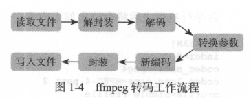
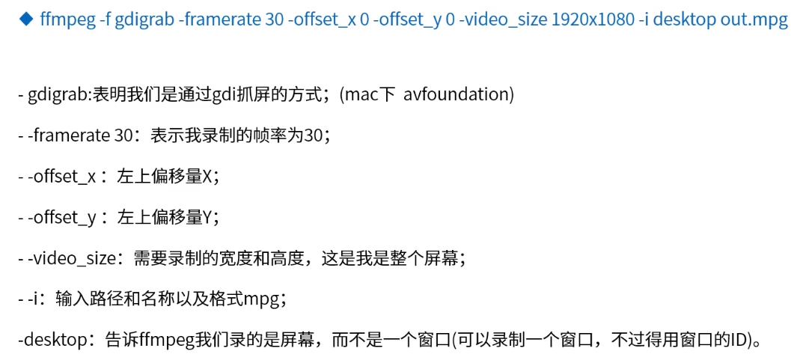
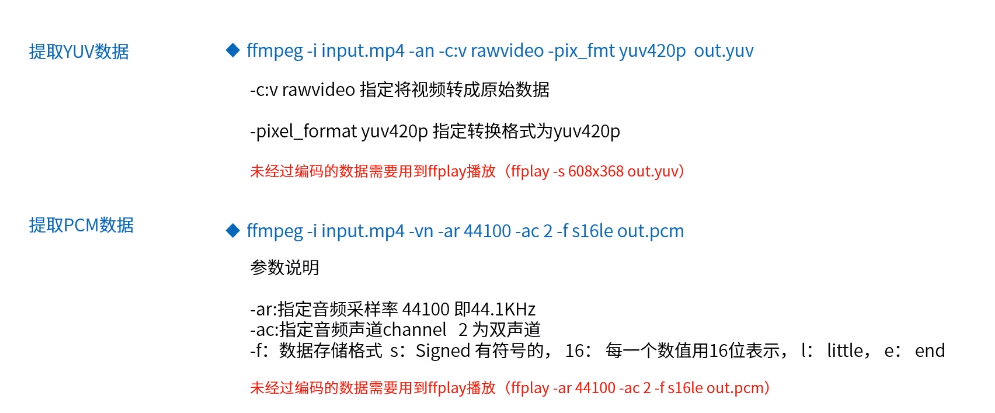
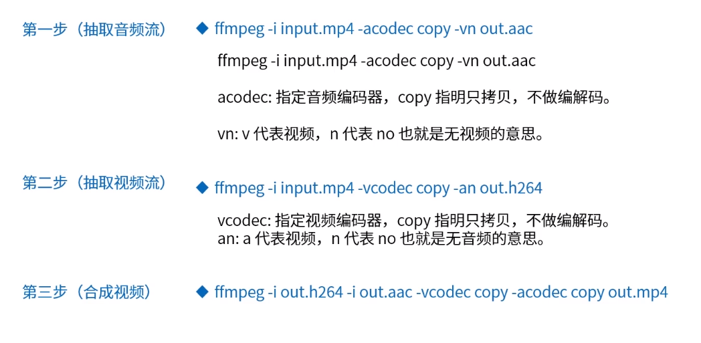

# FFmpeg学习笔记
> A complete, cross-platform solution to record, convert and stream audio and video.

##　FFmpeg介绍
1. AVFormat：封装模块,封装与解封装
   |文件封装格式|网络协议封装格式|
   |---|---
   |MP4，FLV，KV，TS|RTMP，RTSP，MMS，HLS(M3U8)
  FFmpeg 是否支持某种媒体封装格式,取决于编译时是否包含了该格式的封装库。

2. AvCodec : 编解码模块
3. AVFilter： 滤镜模块 
4. ffmpeg主要工作流程
   解封装(Demuxing)->解码(Decoding)->编码(Encoding)->封装(Muxing)
FFmpeg 的解封装( Demuxing )是指将读入的容器格式拆解开,将里面压缩的音频流 、视频流 、 字幕流、数据流等提取出来 , 如果要查看 FFmpeg 的源代码中都可以支持哪些输入的容器格式,可以通过命令./configure 一list-demuxers 来查看

>ffmpeg 首先读取输入源;然后通过 Demuxer 将音视频包进行解封装,这个动作通过调用 libavformat 中的接口即可实现;接下来通过Decoder 进行解码,将音视频通过 Decoder 解包成为 YVU 或者 PCM 这样的数据, Decoder通过 libavcodec 中的接口即可实现;然后通过 Encoder 将对应的数据进行编码,编码可以通过 libavcodec 中的接口来实现;接下来将编码后的音视频数据包通过 Muxer 进行封装,Muxer 封装通过 libavformat 中的接口即可实现,输出成为输出流 。
5. FFmpeg 的播放器 ffplay
>ffplay 是 FFmpeg 源代码编译后生成的另一个可执行程序,与 ffmpeg 在 FFmpeg 项目中充当的角色基本相同,可以作为测试工具进行使用, ffplay 提供了 音视频显示和播放相关的图像信息、音频的波形信息等 。
6. FFmpeg 的多媒体分析器ffprobe
>ffprobe 是一个非常强大的
多媒体分析工具,可以从媒体文件或者媒体流中获得你想要了解的媒体信息,比如音频的参数、视频的参数、媒体容器的参数信息等 。
## 参考文档

[FFmpeg入门](http://www.ruanyifeng.com/blog/2020/01/ffmpeg.html)
[FFMPEG视音频编解码零基础学习方法](https://blog.csdn.net/leixiaohua1020/article/details/15811977)
[视音频编解码技术零基础学习方法](https://blog.csdn.net/leixiaohua1020/article/details/18893769)

## 编译源码
[利用NDK(r20) 编译FFmpeg 4.2.1 Android版本](https://www.codenong.com/jsb1255c463edc/)
[FFmpeg编译脚本](file:///../ffmpeg_build/build_android.sh)

## 概念
1. 编码
所谓的编码就是压缩，减小体积，便于传输和存储
2. 封装格式(容器格式)与编码格式
H.264是视频编码格式，MP3是音频编码格式，MP4是容器格式
3. 原始数据
未经过编码的画面和音频，画面信息(一般是yuv)，音频信息是(pcm)
4. FFmpeg滤镜
原视频->解封装数据包->修改数据帧->编码数据包->新视频
5. 视频播放器原理
```mermaid
graph LR
A(解协议)-->B(解封装)
B-->C(解码)
C-->D(音视频同步)
```
**解协议**的作用，就是将流媒体协议的数据，解析为标准的相应的封装格式数据。视音频在网络上传播的时候，常常采用各种流媒体协议，例如HTTP，RTMP，或是MMS等等。这些协议在传输视音频数据的同时，也会传输一些信令数据。这些信令数据包括对播放的控制（播放，暂停，停止），或者对网络状态的描述等。解协议的过程中会去除掉信令数据而只保留视音频数据。例如，采用RTMP协议传输的数据，经过解协议操作后，输出FLV格式的数据。

**解封装***的作用，就是将输入的封装格式的数据，分离成为音频流压缩编码数据和视频流压缩编码数据。封装格式种类很多，例如MP4，MKV，RMVB，TS，FLV，AVI等等，它的作用就是将已经压缩编码的视频数据和音频数据按照一定的格式放到一起。例如，FLV格式的数据，经过解封装操作后，输出H.264编码的视频码流和AAC编码的音频码流。

**解码**的作用，就是将视频/音频压缩编码数据，解码成为非压缩的视频/音频原始数据。音频的压缩编码标准包含AAC，MP3，AC-3等等，视频的压缩编码标准则包含H.264，MPEG2，VC-1等等。解码是整个系统中最重要也是最复杂的一个环节。通过解码，压缩编码的视频数据输出成为非压缩的颜色数据，例如YUV420P，RGB等等；压缩编码的音频数据输出成为非压缩的音频抽样数据，例如PCM数据。

**视音频同步**的作用，就是根据解封装模块处理过程中获取到的参数信息，同步解码出来的视频和音频数据，并将视频音频数据送至系统的显卡和声卡播放出来。

6. 视频编码
视频编码的主要作用是将视频像素数据（RGB，YUV等）压缩成为视频码流，从而降低视频的数据量。如果视频不经过压缩编码的话，体积通常是非常大的，一部电影可能就要上百G的空间。

7. 音频编码
音频编码的主要作用是将音频采样数据（PCM等）压缩成为音频码流，从而降低音频的数据量。   
## 下载，配置
用的系统是Ubuntu18.04,所以直接apt-get就可以了
sudo apt-get install ffmpeg

## 命令解释
### 录制视频命令

### 处理原始数据

### 分解复用命令

 
## 简介，上手(FFmpeg FFprobe FFplay)
1. 查看ffmpeg的帮助说明，提供的指令
>ffmpeg -h
2. 播放媒体的指令
>ffplay video.mp4
ffplay music.mp3
3. 常用快捷键
按键"Q"或"Esc"：退出媒体播放
键盘方向键：媒体播放的前进后退
点击鼠标右键：拖动到该播放位置
按键"F"：全屏
按键"P"或空格键：暂停
按键"W":切换显示模式
4. 查看媒体参数信息
>ffprobe video.mp4
 
## 转换格式(文件格式,封装格式)
1. 文件名可以是中英文，但不能有空格。
2. 转换格式
>ffmpeg -i video.mp4 video_avi.avi
 
## 改变编码 上(编码,音频转码)
1. 查看编解码器
>ffmpeg -codecs
2. 网站常用编码
MP4封装：H264视频编码+ACC音频编码
WebM封装：VP8视频编码+Vorbis音频编码
OGG封装：Theora视频编码+Vorbis音频编码(开源)
3. 无损编码格式.flac转换编码
ffmpeg -i music_flac.flac -acodec libmp3lame -ar 44100 -ab 320k -ac 2 music_flac_mp3.mp3
说明：
acodec:audio Coder Decoder 音频编码解码器
libmp3lame:mp3解码器
ar:audio rate：音频采样率
44100:设置音频的采样率44100。若不输入，默认用原音频的采样率
ab:audio bit rate 音频比特率
320k：设置音频的比特率。若不输入，默认128K
ac: aduio channels 音频声道
2:声道数。若不输入，默认采用源音频的声道数
 
概括：设置格式的基本套路-先是指名属性，然后跟着新的属性值
 
查看结果属性
ffprobe music_flac_mp3.mp3
 
## 改变编码 中(视频压制)
(1)视频转码
ffmpeg -i video.mp4 -s 1920x1080 -pix_fmt yuv420p -vcodec libx264 -preset medium -profile:v high -level:v 4.1 -crf 23 -acodec aac -ar 44100 -ac 2 -b:a 128k video_avi.avi
说明:
-s 1920x1080：缩放视频新尺寸(size)
-pix_fmt yuv420p：pixel format,用来设置视频颜色空间。参数查询：ffmpeg -pix_fmts
-vcodec libx264：video Coder Decoder，视频编码解码器
-preset medium: 编码器预设。参数：ultrafast,superfast,veryfast,faster,fast,medium,slow,slower,veryslow,placebo
-profile:v high :编码器配置，与压缩比有关。实时通讯-baseline,流媒体-main,超清视频-high
-level:v 4.1 ：对编码器设置的具体规范和限制，权衡压缩比和画质。
-crf 23 ：设置码率控制模式。constant rate factor-恒定速率因子模式。范围0~51,默认23。数值越小，画质越高。一般在8~28做出选择。
-r 30 :设置视频帧率
-acodec aac :audio Coder Decoder-音频编码解码器
-b:a 128k :音频比特率.大多数网站限制音频比特率128k,129k
其他参考上一个教程
 
## 改变编码 下(码率控制模式)
ffmpeg支持的码率控制模式：-qp -crf -b
(1)
-qp :constant quantizer,恒定量化器模式
无损压缩的例子（快速编码）
ffmpeg -i input -vcodec libx264 -preset ultrafast -qp 0 output.mkv
无损压缩的例子（高压缩比）
ffmpeg -i input -vcodec libx264 -preset veryslow -qp 0 output.mkv
(2)
-crf :constant rate factor,恒定速率因子模式
(3)
-b ：bitrate,固定目标码率模式。一般不建议使用
 
3种模式默认单遍编码
 
VBR(Variable Bit Rate/动态比特率) 例子
ffmpeg -i input -vcodec libx264 -preset veryslow output
ABR(Average Bit Rate/平均比特率) 例子
ffmpeg -i input -vcodec libx264 -preset veryslow -b:v 3000k output
CBR(Constant Bit Rate/恒定比特率) 例子
... -b:v 4000k -minrate 4000k -maxrate 4000k -bufsize 1835k ...
 
## 合并,提取音视频
(1)单独提取视频（不含音频流）
>ffmpeg -i video.mp4 -vcodec copy -an video_silent.mp4

(2)单独提取音频（不含视频流）
>ffmpeg -i video.mp4 -vn -acodec copy video_novideo.m4a
 
具备多个音频流的，如
Stream #0:2[0x81]:Audio:ac3,48000Hz,5.1,s16,384kb/s
Stream #0:3[0x82]:Audio:ac3,48000Hz,5.1,s16,384kb/s
Stream #0:4[0x80]:Audio:ac3,48000Hz,5.1,s16,448kb/s
 
针对性的单一的提取，例如提取第2条，用指令： -map 0:3

(3)合并音视频
>ffmpeg -i video_novideo.m4a -i video_silent.mp4 -c copy video_merge.mp4
 
## 截取，连接音视频
(1)截取
>ffmpeg -i music.mp3 -ss 00:00:30 -to 00:02:00 -acodec copy music_cutout.mp3

截取60秒
>ffmpeg -i music.mp3 -ss 00:00:30 -t 60 -acodec copy music_cutout60s.mp3
 
-sseof : 从媒体末尾开始截取
 
ffmpeg -i in.mp4 -ss 00:01:00 -to 00:01:10 -c copy out.mp4
ffmpeg -ss 00:01:00 -i in.mp4 -to 00:01:10 -c copy out.mp4
ffmpeg -ss 00:01:00 -i in.mp4 -to 00:01:10 -c copy -copyts out.mp4
 
把-ss放到-i之前，启用了关键帧技术，加速操作。但截取的时间段不一定准确。可用最后一条指令，保留时间戳，保证时间准确。
(2)连接音视频
ffmpeg -i "concat:01.mp4|02.mp4|03.mp4" -c copy out.mp4
 
不同格式的音视频可以连接在一起，但不推荐不同格式连接在一起。
建议使用Avidemux软件连接
 
## 截图,水印,动图
(1)截图.
截取第7秒第1帧的画面
ffmpeg -i video.mp4 -ss 7 -vframes 1 video_image.jpg
(2)水印
ffmpeg -i video.mp4 -i qt.png -filter_complex "overlay=20:80" video_watermark.mp4
(3)截取动图
ffmpeg -i video.mp4 -ss 7.5 -to 8.5 -s 640x320 -r 15 video_gif.gif
 
## 录屏,直播
(1)录屏
windows: ffmpeg -f gdigrab -i desktop rec.mp4
ubuntu: sudo ffmpeg -f fbdev -framerate 10 -i /dev/fb0 rec.mp4
 
gdigrab ：ffmpeg中的一个组件。
只捕获视频.若要录屏，录音，获取摄像头，麦克风，换组件，用OBS Studio软件
 
(2)直播
ffmpeg -re i rec.mp4 按照网站要求编码 -f flv "你的rtmp地址/你的直播码"
 
 
官方教程
http://ffmpeg.org/ffmpeg-all.html