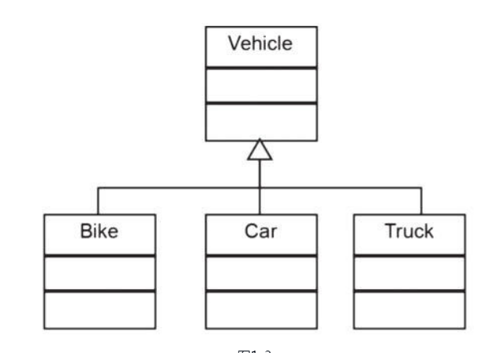
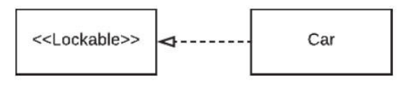
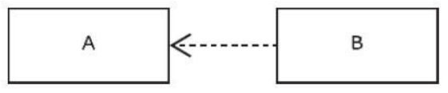
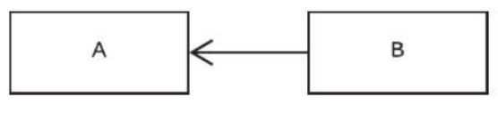
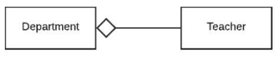
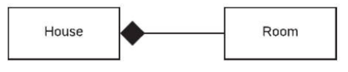
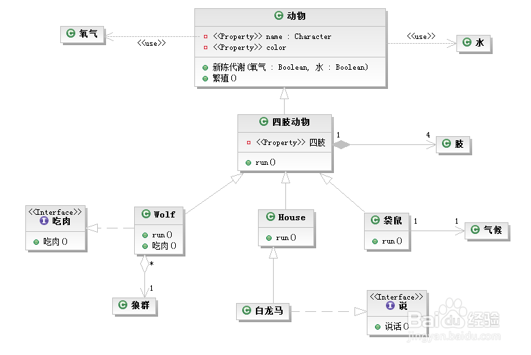

Title: UML类图关系
Date: 2021-1-8 18:23:00
Category: 计算机
Tags:UML

在UML类图中，常见的有以下几种关系: 
# 继承(泛化)

继承也被称为Is-A关系, 自行车是车、猫是动物

表示：泛化关系用一条带空心箭头的直接表示

# 实现
接口实现

# 依赖
Uses-A 关系

它用于定义一个类以某种方式依赖于另一个类，而另一个类可能依赖于或不依赖于第一个类。通常，在面向对象的编程语言中，依赖关系用于描述一个类在方法的声明中是否包含第二个类的参数，或者说它只是通过方法将第二个类传递给其他类，而不是使用方法来创建第二个类的实例。

依赖也有方向，双向依赖是一种非常糟糕的结构，我们总是应该保持单向依赖，杜绝双向依赖的产生；

在最终代码中，依赖关系体现为**类构造方法**及**类方法**的传入参数，箭头的指向为调用关系；依赖关系除了临时知道对方外，还是“使用”对方的方法和属性；

表示：依赖关系是用一套带箭头的虚线表示的。B依赖于A，描述一个对象在运行期间会用到另一个对象的关系

# 关联
Has-A关系

关联表示两个实体之间的关系。有两种类型的关联：组合和聚合。通常，关联关系由箭头表示。

如果特别强调方向，如下图，表示B知道A，但 A不知道B；

# 聚合

整体和部分不是强依赖的。

一个类在逻辑上包含另一个类，但所包含的类的实例又可以独立于第一个类在其上下文之外生存，或者可以被其他的类所引用。

例如，部门与教师间存在Has-A关系，每位教师必须属于部门，但如果部门不再存在，教师仍然可以处于活动状态,

老师聚合到部门上，或者部门由老师组成。

表示：聚合关系用一条带空心菱形箭头的直线表示

# 组合

一个类是另一个类的组成部分就称两者间存在组合关系。这有点类似于聚合，不同之处在于当主类不再存在时，依赖类不再存在。例如，房子（House）由房间（Room）组成，但如果房子被销毁，房间就不再存在，

表示：组合关系用一条带实心菱形箭头直线表示。

# 依赖与关联的区别

关联：互相贯连的意思，是比较强的关系，是长期关系。
类A关联B的含义是：如果实例化一个A类的对象，同时会有一个B类的对象被实例化。

依赖：成瘾的意思，玩游戏上瘾，你也可以戒掉，所以依赖只是临时关系

# 关系整合图

来源于网上

# 参考链接

1. [看懂UML类图和时序图](https://design-patterns.readthedocs.io/zh_CN/latest/read_uml.html#id2)
2. [UML类图几种关系的总结（图文并茂、案例详解）](https://jingyan.baidu.com/article/ad310e80f7d5c01848f49e6b.html)
3. [继承、实现、依赖、关联、聚合、组合的联系与区别](https://www.jianshu.com/p/fe949c2f081a)
4. [UML类图关系(泛化 、实现、依赖、关联、聚合、组合)](https://blog.csdn.net/ochangwen/article/details/72621702)
5. [UML类图关系（泛化 、继承、实现、依赖、关联、聚合、组合）](https://www.cnblogs.com/olvo/archive/2012/05/03/2481014.html)
