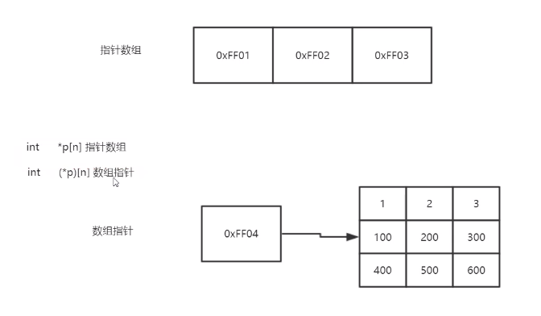

# C/C++语法记录
## 指针的用法
```c
#include <stdio.h>

int main(){
    // 一维数组
    int arr[] = {100,200,300};
    // 打印一维数组数据
    for(int i=0;i<3;i++){
        printf("数组 %d\n",arr[i]);
    }
    // 一维数组中第二个元素地址赋给int型p指针
    // 数组坐标从零开始
    int *p = &arr[1];
    // p指针往后移一个单位位置，一个单位是int4个字节
    // 这里打印的是数组的第三个元素
    printf("p=%d\n",*(++p));
    return 0;
}
```
打印结果
```
数组 100
数组 200
数组 300
p=300
```
1. 指针数组与数组指针的区别
- 指针数组：存放指针的数组
- 数组指针：数组的指针



int *p[n]指针数组 等于 int* p[n]

int (*p)[n]数组指针

优先级
() > [] > *


