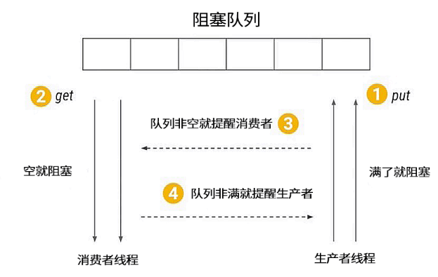
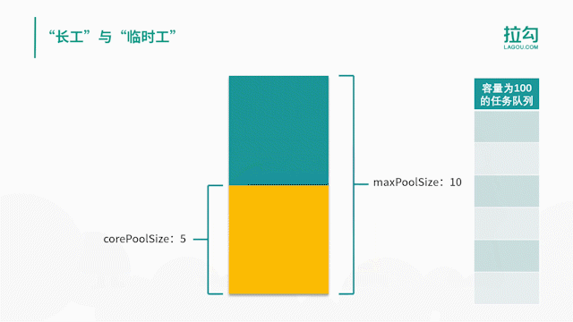

Title: 多线程相关笔记
Date: 2020-1-5 14:00:00
Category: 计算机
Tags:Android,多线程

# 概念

## 同步与异步
同步和异步通常用来形容一次方法调用。同步方法调用一旦开始，调用者必须等到方法调用返回后，才能继续后续的行为。**异步方法**调用更像一个消息传递，一旦开始，方法调用就会立即返回，调用者就可以继续后续的操作
## 并发与并行
并行的多个任务是真的同时执行(多核多线程), 而对于并发来说，这个过程只是交替的，一会儿执行任务A，一会儿执行任务B，系统会不停地在两者之间切换。
## 临界区
临界区就是在同一时刻只能有一个任务访问的代码区。
```java
synchronized(syncObject) { 
    //critical section
}
```
也可以用ReentrantLock来实现临界区
## 阻塞（Blocking）和非阻塞（Non-Blocking）
阻塞和非阻塞关注的是程序在等待调用结果（消息，返回值）时的**状态**.
阻塞调用是指调用结果返回之前，当前线程会被挂起。调用线程只有在得到结果之后才会返回。
非阻塞调用指在不能立刻得到结果之前，该调用不会阻塞当前线程。
你打电话问书店老板有没有《分布式系统》这本书，你如果是阻塞式调用，你会一直把自己“挂起”，直到得到这本书有没有的结果，如果是非阻塞式调用，你不管老板有没有告诉你，你自己先一边去玩了， 当然你也要偶尔过几分钟check一下老板有没有返回结果。在这里阻塞与非阻塞与是否同步异步无关。跟老板通过什么方式回答你结果无关。
## 死锁（Deadlock）、饥饿（Starvation）和活锁（Livelock）
[Java多线程的死锁，活锁，饥饿](https://blog.csdn.net/qq_29924795/article/details/72772251)

## 可见性
可见性是指当一个线程修改了某一个共享变量的值时，其他线程是否能够立即知道这个修改。**volatile**关键字并不能真正保证线程安全。它只能确保一个线程修改了数据后，其他线程能够看到这个改动。但当两个线程同时修改某一个数据时，依然会产生冲突。

## 线程的生命周期
Thread中State枚举定义
```java
public enum State{
    NEW,
    RUNNABLE,
    BLOCKED,
    WAITING,
    TIME_WAITING,
    TERMINATED
}
```


>NEW状态表示刚刚创建的线程，这种线程还没开始执行。等到线程的start()方法调用时，才表示线程开始执行。当线程执行时，处于RUNNABLE状态，表示线程所需的一切资源都已经准备好了。如果线程在执行过程中遇到了synchronized同步块，就会进入BLOCKED阻塞状态，这时线程就会暂停执行，直到获得请求的锁。WAITING和TIMED_WAITING都表示等待状态，它们的区别是WAITING会进入一个无时间限制的等待，TIMED_WAITING会进行一个有时限的等待。那么等待的线程究竟在等什么呢？一般来说，WAITING的线程正是在等待一些特殊的事件。比如，通过wait()方法等待的线程在等待notify()方法，而通过join()方法等待的线程则会等待目标线程的终止。一旦等到了期望的事件，线程就会再次执行，进入RUNNABLE状态。当线程执行完毕后，则进入TERMINATED状态，表示结束。

## 创建线程的方式
1. 可以继承Thread类
2. 实现Runnable接口

## 线程终止
一般来说，线程执行完毕就会结束，无须手工关闭。
stop()方法过于暴力，强行把执行到一半的线程终止，可能会引起一些数据不一致的问题。
Thread.stop()方法在结束线程时，会直接终止线程，并立即释放这个线程所持有的锁，而这些锁恰恰是用来维持对象一致性的。如果此时，写线程写入数据正写到一半，并强行终止，那么对象就会被写坏，同时，由于锁已经被释放，另外一个等待该锁的读线程就顺理成章地读到了这个不一致的对象，悲剧也就此发生。
## 线程中断
在Java中，线程中断是一种重要的线程协作机制。使用stop方法终止线程是不安全的，官方也不推荐使用，我们可以根据线程的中断状态，自行处理中断逻辑。
```java
// 它通知目标线程中断，也就是设置中断标志位
public void interrupt()
// 判断线程是否被标记为中断状态
public boolean isInterrupted()
// 判断是否被中断，并清除当前线程的中断状态
public static boolean interrupted()
```
[中断的Demo](./src/InterruptDemo.java)


## wait与notify
```java
// throws IllegalMonitorStateException
public final native void notify() 

// throws InterruptedException, IllegalMonitorStateException
public final void wait() throws InterruptedException
```
wait和notify两个方法是Object的方法，不能直接调用这两个方法，你必须在调用前获取object的锁。
>在线程A中，调用了obj.wait()方法，那么线程A就会停止继续执行，转为等待状态。等待到何时结束呢？线程A会一直等到其他线程调用了obj.notify()方法为止。这时，object对象俨然成了多个线程之间的有效通信手段。
如果一个线程调用了object.wait()方法，那么它就会进入object对象的等待队列。这个等待队列中，可能会有多个线程，因为系统运行多个线程同时等待某一个对象。当object.notify()方法被调用时，它就会从这个等待队列中随机选择一个线程，并将其唤醒。这里希望大家注意的是，这个选择是不公平的，并不是先等待的线程就会优先被选择，这个选择完全是随机的。

生产者与消费者

```java
class MyBlockingQueue {
 
   private int maxSize;
   private LinkedList<Object> storage;
 
   public MyBlockingQueue(int size) {
       this.maxSize = size;
       storage = new LinkedList<>();
   }
 
   public synchronized void put() throws InterruptedException {
       while (storage.size() == maxSize) {
           wait();
       }
       storage.add(new Object());
       notifyAll();
   }
 
   public synchronized void take() throws InterruptedException {
       while (storage.size() == 0) {
           wait();
       }
       System.out.println(storage.remove());
       notifyAll();
   }
}

```
wait()需要被包在while循环里多次判断wait的执行条件，在上面代码中阻塞队列为空时消费者执行wait操作，释放锁资源。
>wait为什么需要包在while循环里多次判断条件？因为假如你不多次判断，而只判断一次的话会出现阻塞队列为空的时候，消费者去取数据。当有A，B两个消费者都在wait状态，此时生产者添加数据到队列执行notify唤醒消费者，消费者B获取到锁资源然后消费它执行notify，有可能唤醒消费者A执行消费操作就出错了，因为队列是没有数据的。所以执行wait之前需要多此判断条件。

## join与yeild
```java
// Thread.yield();
public static native void yield();
// join调用的是join(0)
public final void join() throws InterruptedException
public final synchronized void join(long millis)
    throws InterruptedException 
```
**Thread.yield**当前线程让出cpu，但要注意，让出CPU并不表示当前线程不执行了。当前线程在让出CPU后，还会进行CPU资源的争夺，但是是否能够再次被分配到就不一定了。如果你觉得一个线程不那么重要，或者优先级非常低，而且又害怕它会占用太多的CPU资源，那么可以在适当的时候调用Thread.yield()方法，给予其他重要线程更多的工作机会。
**join**是线程中的方法，查看源码得知它本质上时调用wait方法，比如在主线程中调用线程A的join方法，主线程是释放对象A的锁，然后主线程进入waitting状态，直到线程A执行完释放对象A的锁，主线程才有机会继续执行。

[Java中join()方法的理解](https://www.cnblogs.com/aademeng/articles/10882539.html)

## 线程组
>  在java的多线程处理中有线程组ThreadGroup的概念，ThreadGroup是为了方便线程管理出现了，可以统一设定线程组的一些属性，比如setDaemon，设置未处理异常的处理方法，设置统一的安全策略等等；也可以通过线程组方便的获得线程的一些信息。
每一个ThreadGroup都可以包含一组的子线程和一组子线程组，在一个进程中线程组是以树形的方式存在，通常情况下根线程组是system线程组。system线程组下是main线程组，默认情况下第一级应用自己的线程组是通过main线程组创建出来的。

[java线程组（ThreadGroup）](https://blog.csdn.net/laomumu1992/article/details/102905585)

## 守护线程
[java中的用户线程和守护线程](https://blog.csdn.net/qq_41063141/article/details/91939540)

## 线程优先级
>线程可以有自己的优先级。优先级高的线程在竞争资源时会更有优势，更**可能**抢占资源。
在Java中，使用1到10表示线程优先级，数字越大则优先级越高。
```java
   /**
     * The minimum priority that a thread can have.
     */
    public final static int MIN_PRIORITY = 1;

   /**
     * The default priority that is assigned to a thread.
     */
    public final static int NORM_PRIORITY = 5;

    /**
     * The maximum priority that a thread can have.
     */
    public final static int MAX_PRIORITY = 10;
```

## 重入锁ReentrantLock
>重入锁使用ReentrantLock类来实现,可以完全替代关键字synchronized，在JDK 5.0的早期版本中，重入锁的性能远远优于关键字synchronized，但从JDK 6.0开始，JDK在关键字synchronized上做了大量的优化，使得两者的性能差距并不大。开发人员必须手动指定何时加锁，何时释放锁。也正因为这样，重入锁对逻辑控制的灵活性要远远优于关键字synchronized。
```java
// 获得锁，如果锁已经被占用，则等待
lock()：
// 获得锁，但优先响应中断
lockInterruptibly()：
// 尝试获得锁，如果成功，则返回true，失败返回false。该方法不等待，立即返回
tryLock()：
//在给定时间内尝试获得锁
tryLock(long time, TimeUnit unit)：
//释放锁
unlock()：
```
```java
class X {
    private final ReentrantLock lock = new ReentrantLock();
    // ...
 
    public void m() {
      lock.lock();  // block until condition holds
      try {
        // ... method body
      } finally {
        lock.unlock();
      }
    }
  }}
```
```java
lock.lock();  // block until condition holds
lock.lock();
try {
// ... method body
} finally {
    lock.unlock();
    lock.unlock();
}
```
同一个线程多次获得锁，那么在释放锁的时候，也必须释放相同次数。如果释放锁的次数多了，那么会得到一个java.lang.IllegalMonitorStateException异常，反之，如果释放锁的次数少了，那么相当于线程还持有这个锁，因此，其他线程也无法进入临界区。

### 公平锁
ReentrantLock fairLock = new ReentrantLock(true) 构造函数中的参数设置为true
```java
/**
 * 公平锁Demo
 */
class ReentrantLockDemo implements Runnable {

    public static ReentrantLock fairLock = new ReentrantLock(true);

    @Override
    public void run() {
        while (true) {
            try {
                fairLock.lock();
                try {
                    Thread.sleep(1000L);
                } catch (InterruptedException e) {
                    e.printStackTrace();
                }
                System.out.println(Thread.currentThread().getName()+" 获到锁");
            }finally{
                fairLock.unlock();    
            }
            
        }
    }

    public static void main(String[] args) {
        ReentrantLockDemo reentrantLockDemo = new ReentrantLockDemo(); 
        Thread t1 = new Thread(reentrantLockDemo,"t1");
        Thread t2 = new Thread(reentrantLockDemo,"t2");
        t1.start();
        t2.start();
    }

}
```
运行结果如下：
```java
t1 获到锁
t2 获到锁
t1 获到锁
t2 获到锁
...
````
可以看到在公平锁下线程交替获取到锁，显得很公平
ReentrantLock.lock和ReentrantLock.unlock类似于synchronized作用。
### Condition使用
>它与wait()方法和notify()方法的作用是大致相同的。但是wait()方法和notify()方法是与synchronized关键字合作使用的，而Condition是与重入锁相关联的。通过lock接口（重入锁就实现了这一接口）的Condition newCondition()方法可以生成一个与当前重入锁绑定的Condition实例。利用Condition对象，我们就可以让线程在合适的时间等待，或者在某一个特定的时刻得到通知，继续执行。

Condition有几个方法如下
1. await()方法会使当前线程等待，同时释放当前锁，当其他线程中使用signal()方法或者signalAll()方法时，线程会重新获得锁并继续执行。或者当线程被中断时，也能跳出等待。这和Object.wait()方法相似。
2. awaitUninterruptibly()方法与await()方法基本相同，但是它并不会在等待过程中响应中断。

3. singal()方法用于唤醒一个在等待中的线程，singalAll()方法会唤醒所有在等待中的线程。这和Obejct.notify()方法很类似。

## 线程池
为了避免系统频繁地创建和销毁线程，我们可以让创建的线程复用。
- 线程池的各个参数的含义
```java
// 初始化线程池
public ThreadPoolExecutor(
        // 核心线程数 正式工数量
        int corePoolSize, 
        // 最大线程数
        int maximumPoolSize,
        // 空闲线程存活的时间
        long keepAliveTime,
        // 存活时间的单位
        TimeUnit unit,
        // 用于存放任务的队列
        BlockingQueue<Runnable> workQueue,
        // 创建新线程的工厂
        ThreadFactory threadFactory,
        // 处理被拒绝的任务
        RejectedExecutionHandler handler
)
```
corePoolSize 是核心线程数，也就是常驻线程池的线程数量，与它对应的是 maxPoolSize，表示线程池最大线程数量，当我们的任务特别多而 corePoolSize 核心线程数无法满足需求的时候，就会向线程池中增加线程，以便应对任务突增的情况。

接下来，我们来具体看下这两个参数所代表的含义，以及线程池中创建线程的时机。如上图所示，当提交任务后，线程池首先会检查当前线程数，如果此时线程数小于核心线程数，比如最开始线程数量为 0，则新建线程并执行任务，随着任务的不断增加，线程数会逐渐增加并达到核心线程数，此时如果仍有任务被不断提交，就会被放入 workQueue 任务队列中，等待核心线程执行完当前任务后重新从 workQueue 中提取正在等待被执行的任务。

 

此时，假设我们的任务特别的多，已经达到了 workQueue 的容量上限，这时线程池就会启动后备力量，也就是 maxPoolSize 最大线程数，线程池会在 corePoolSize 核心线程数的基础上继续创建线程来执行任务，假设任务被不断提交，线程池会持续创建线程直到线程数达到 maxPoolSize 最大线程数，如果依然有任务被提交，这就超过了线程池的最大处理能力，这个时候线程池就会拒绝这些任务，我们可以看到实际上任务进来之后，线程池会逐一判断 corePoolSize 、workQueue 、maxPoolSize ，如果依然不能满足需求，则会拒绝任务。



- 线程池的阻塞队列
线程池中的这四个主要组成部分最值得我们关注的就是阻塞队列了，如表格所示，不同的线程池会选用不同的阻塞队列。


表格左侧是线程池，右侧为它们对应的阻塞队列，你可以看到 5 种线程池对应了 3 种阻塞队列，我们接下来对它们进行逐一的介绍。

**LinkedBlockingQueue**     
对于 FixedThreadPool 和 SingleThreadExector 而言，它们使用的阻塞队列是容量为 Integer.MAX_VALUE 的 LinkedBlockingQueue，可以认为是无界队列。由于 FixedThreadPool 线程池的线程数是固定的，所以没有办法增加特别多的线程来处理任务，这时就需要 LinkedBlockingQueue 这样一个没有容量限制的阻塞队列来存放任务。这里需要注意，由于线程池的任务队列永远不会放满，所以线程池只会创建核心线程数量的线程，所以此时的最大线程数对线程池来说没有意义，因为并不会触发生成多于核心线程数的线程。

**SynchronousQueue**      
第二种阻塞队列是 SynchronousQueue，对应的线程池是 CachedThreadPool。线程池 CachedThreadPool 的最大线程数是 Integer 的最大值，可以理解为线程数是可以无限扩展的。CachedThreadPool 和上一种线程池 FixedThreadPool 的情况恰恰相反，FixedThreadPool 的情况是阻塞队列的容量是无限的，而这里 CachedThreadPool 是线程数可以无限扩展，所以 CachedThreadPool 线程池并不需要一个任务队列来存储任务，因为一旦有任务被提交就直接转发给线程或者创建新线程来执行，而不需要另外保存它们。


我们自己创建使用 SynchronousQueue 的线程池时，如果不希望任务被拒绝，那么就需要注意设置最大线程数要尽可能大一些，以免发生任务数大于最大线程数时，没办法把任务放到队列中也没有足够线程来执行任务的情况。

**DelayedWorkQueue**       
第三种阻塞队列是DelayedWorkQueue，它对应的线程池分别是 ScheduledThreadPool 和 SingleThreadScheduledExecutor，这两种线程池的最大特点就是可以延迟执行任务，比如说一定时间后执行任务或是每隔一定的时间执行一次任务。DelayedWorkQueue 的特点是内部元素并不是按照放入的时间排序，而是会按照延迟的时间长短对任务进行排序，内部采用的是“堆”的数据结构。之所以线程池 ScheduledThreadPool 和 SingleThreadScheduledExecutor 选择 DelayedWorkQueue，是因为它们本身正是基于时间执行任务的，而延迟队列正好可以把任务按时间进行排序，方便任务的执行。

## volatile

>保证可见性，不保证原子性

- volatile 和 synchronized 的关系

相似性：volatile 可以看作是一个轻量版的 synchronized，比如一个共享变量如果自始至终只被各个线程赋值和读取，而没有其他操作的话，那么就可以用 volatile 来代替 synchronized 或者代替原子变量，足以保证线程安全。实际上，对 volatile 字段的每次读取或写入都类似于“半同步”——读取 volatile 与获取 synchronized 锁有相同的内存语义，而写入 volatile 与释放 synchronized 锁具有相同的语义。

不可代替：但是在更多的情况下，volatile 是不能代替 synchronized 的，volatile 并没有提供原子性和互斥性。

性能方面：volatile 属性的读写操作都是无锁的，正是因为无锁，所以不需要花费时间在获取锁和释放锁上，所以说它是高性能的，比 synchronized 性能更好。


## 参考链接
[怎样理解阻塞非阻塞与同步异步的区别？](https://www.zhihu.com/question/19732473)
[并发之原子性、可见性、有序性](https://www.cnblogs.com/guanghe/p/9206635.html)
[Java多线程之临界区、ThreadLocal](https://blog.csdn.net/fan2012huan/article/details/51781443)
[实战java高并发程序设计]()
[Java并发编程：volatile关键字解析](https://www.cnblogs.com/dolphin0520/p/3920373.html)
[Java多线程共享变量控制](https://www.cnblogs.com/soaringEveryday/p/4418604.html)
## JMM(java内存模型)
重排序，原子性，内存可见性

## 面试
- 实现runnable接口的3个好处
1. Runnable 与 Thread 类的解耦，Runnable负责执行的内容，Thread 类负责线程启动和属性设置等内容，权责分明。
2. Runnable可以结合线程池一起使用
3.  Java 语言不支持双继承，如果我们的类一旦继承了 Thread 类，那么它后续就没有办法再继承其他的类，这样一来，如果未来这个类需要继承其他类实现一些功能上的拓展，它就没有办法做到了，相当于限制了代码未来的可拓展性。
- [volatile的适用场景](https://blog.csdn.net/vking_wang/article/details/9982709)