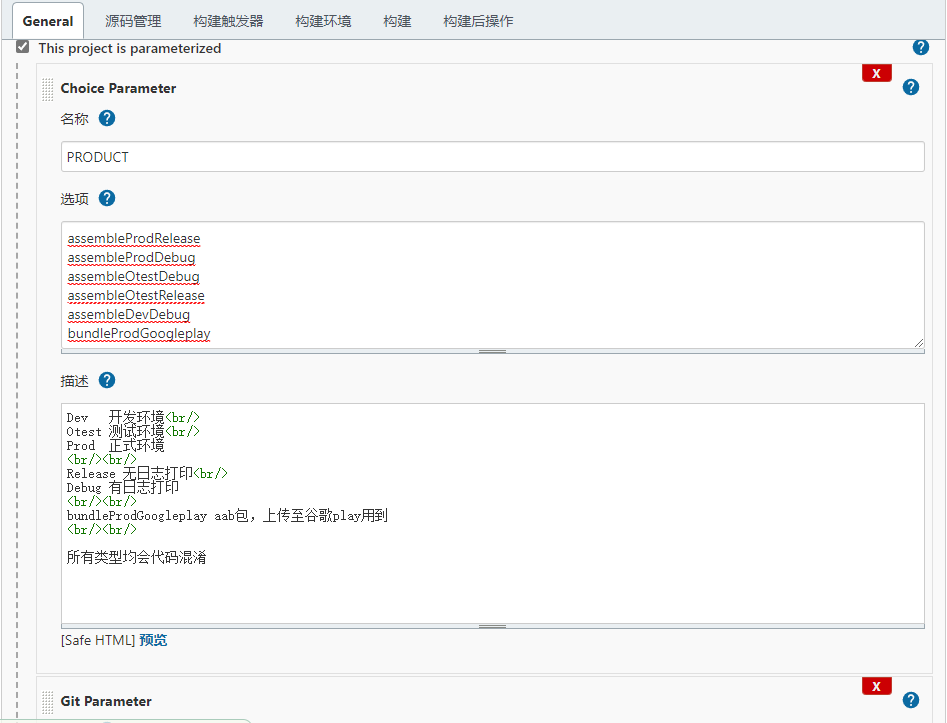

~~~bash
cd ${WORKSPACE}/Haylou

outputsPath="${WORKSPACE}/Haylou/app/build/"
if [ -e $outputsPath ];then
find $outputsPath  -type f -delete
else
echo "$outputsPath不存在"
fi

/usr/local/gradle-6.8/bin/gradle clean
/usr/local/gradle-6.8/bin/gradle $PRODUCT
jiaguPath="/home/360jiagubao_linux_x64/jiagu/"
echo $outputsPath
export apkPath=`find $outputsPath  -name "*.apk"`
export SEND_MSG_URL="https://oapi.dingtalk.com/robot/send?access_token=c70dd54f4d7"

export rePath=${apkPath##*/${JOB_NAME}/}
export remoteApkPath="${JENKINS_URL%/*}:8080/job/${JOB_NAME}/${BUILD_ID}/artifact/${rePath}"

if [ "$isNotify" = true ]; then
bash  /home/dingding.sh
fi    
~~~

dingding.sh
~~~bash
curl ${SEND_MSG_URL} \
  -H 'Content-Type: application/json' \
  --data  @<(cat <<EOF
 {
     "msgtype": "text",
     "text": {
         "title":"打包提醒",
         "content": "打包提醒:\n【${apkPath##*/}】\n$remoteApkPath \n\n★BuildId: $BUILD_ID \n★更新内容:\n$updateLog"
      },
     "at":{
                 "atMobiles":["13723402250","15917620886","18664925882"],
                 "atUserIds":["朱胜文","林秀敏","胡友"],
                 "isAtAll":true
                }

 }

EOF
 )

~~~